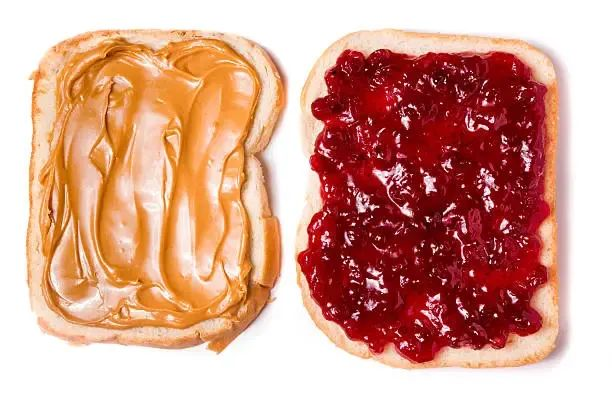

# How to Make a PB&J: A Markdown Masterclass
---
## 1. Required Materials

Before you begin, ensure you have the following components. In Markdown, we use **unordered lists** for items where order doesn't matter:

- **Bread:** 2 slices (White, Sourdough, or Whole Wheat).
    
- **Peanut Butter:** Creamy or Crunchy.
- **Jelly/Jam:** Grape or Strawberry are classics.
    
- **Tools:** A butter knife and a plate.
    

### The Essential Hardware

|**Component**|**Function**|**Material**|
|---|---|---|
|Bread|The Foundation|Wheat/Flour|
|PB|The Glue|Peanuts|
|Jelly|The Sweetness|Fruit/Sugar|

---

## 2. Step-by-Step Instructions

Since the order is vital here, we use a **numbered list**:

1. **Prepare the Bread:** Lay two slices of bread flat on your plate.
    
    > [!NOTE]
    > 
    > To prevent the bread from getting soggy, some experts recommend a "double-barrier" method by applying a thin layer of peanut butter to both slices of bread.
    
2. **Apply Peanut Butter:** Use your knife to spread an even layer on one slice.
    
    - _Tip: Spread all the way to the edges!_
        
3. **Apply Jelly:** Clean your knife (or use a second one) to spread jelly on the other slice.
    
4. **The Assembly:** Flip the peanut butter slice onto the jelly slice with precision.
    

---

## 3. Important Considerations

### Dietary Warnings

> [!CAUTION]
> 
> Nut Allergies: This recipe contains peanuts. If you or your guest have an allergy, substitute with Sunflower Butter or Soy Nut Butter.

### Storage and Longevity

If you are packing this for later, consider the following:

- **Do not** cut the sandwich until you are ready to eat it to keep it fresh.
    
- **Wrap** tightly in parchment paper or a reusable beeswax wrap.
    

---

## 4. Advanced "Pro" Techniques

If you want to take your sandwich to the next level, you might try adding these "add-ons":

- `Honey` drizzle for extra sweetness.
    
- `Banana` slices for texture.
    
- `Sea salt` to enhance the peanut flavor.
    

---

## 5. Conclusion

Once you have mastered the PB&J, you have mastered the basics of Markdown! You've used:

1. **Headings** for structure.
    
2. **Lists** (ordered and unordered) for steps and items.
    
3. **Tables** for data comparison.
    
4. **Callouts** (Note/Caution) for emphasis.
    
5. **Inline Code** for specific ingredients.
    
