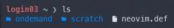
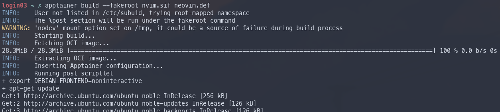
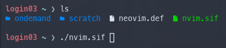
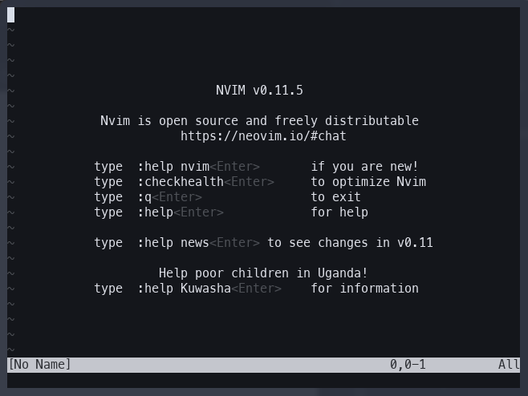
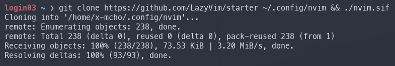
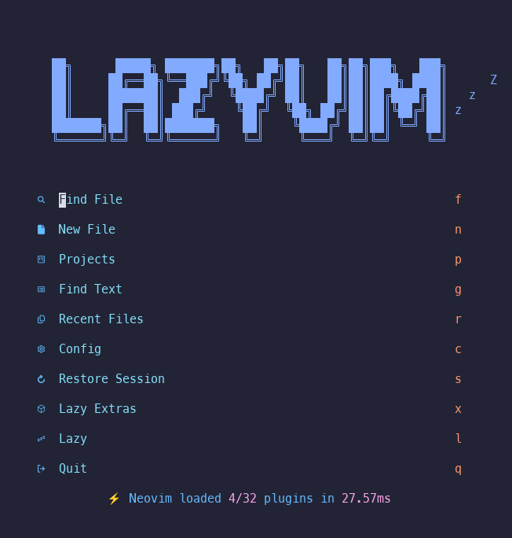

# Neovim on High Performance Computing Clusters
---
For my workflow, I jump from several different servers and high performance computing (HPC) clusters for dataset management, processing, and deep learning applications leveraging graphics processing units (GPUs). In the past, I would use Visual Studio Code and Remote SSH to access these endpoints, modify code, and execute commands. However, I recently fell in love with the enjoyment, simplicity, and speed of Neovim. 

There's one problem — enterprise servers, especially for HPC workloads, often do not support the latest versions of Neovim with all the crucial features like language server protocols and community plugins. Fortunately, HPC research clusters and many enterprise server services support a container platform called [Apptainer](https://apptainer.org/docs/user/latest/introduction.html) (formerly Singularity), which enables users to "run complex applications on HPC clusters in a simple, portable, and reproducible way". 

In this tutorial, I'll show you how to setup the latest version of Neovim and [LazyVim](https://www.lazyvim.org/) for a full-fledged IDE on your own HPC cluster ecosystem.

# Checking for the Apptainer Module
---
If you're this far into the tutorial, I'm going to assume that you already have access to your University's HPC resources, and you know how to SSH into a login node. However, feel free to email me or comment below if you need any help!

After successfully connecting to a login node through SSH, you can check if Apptainer is available with `apptainer --version`. Below, I'm connected to the [Purdue Anvil]() cluster and Apptainer is already loaded from the login nodes. 

> Some HPC clusters will not have the Apptainer module available on login nodes (e.g., PACE Phoenix at Georgia Tech). You will have to connect to a computing node before proceeding and use `module load apptainer` to load the module.


# Creating a Definition File
---
In order to create a custom container for the Apptainer platform, you need read from a custom definition file (.def), which is like a script of packages and parameters that Apptainer will execute and install while creating your container. Below, I have a predefined .def file that installs all the necessary dependencies and installs Neovim version 11.5. 

```
Bootstrap: docker
From: ubuntu:24.04

%post
    # --- 1. System Dependencies ---
    export DEBIAN_FRONTEND=noninteractive
    
    # Install curl/ca-certificates first to set up repos
    apt-get update && apt-get install -y curl ca-certificates gnupg

    # --- 2. Set up Node.js 22 Repository ---
    mkdir -p /etc/apt/keyrings
    curl -fsSL https://deb.nodesource.com/gpgkey/nodesource-repo.gpg.key | gpg --dearmor -o /etc/apt/keyrings/nodesource.gpg
    echo "deb [signed-by=/etc/apt/keyrings/nodesource.gpg] https://deb.nodesource.com/node_22.x nodistro main" | tee /etc/apt/sources.list.d/nodesource.list

    # Update again and install base tools + Node.js 22
    # Added python3-venv (crucial for python dev)
    apt-get update && apt-get install -y \
        nodejs \
        python3-venv \
        wget \
        git \
        build-essential \
        unzip \
        tar \
        gzip \
        locales

    # Fix locale (critical for nvim icons/TUI)
    locale-gen en_US.UTF-8

    # --- 3. Install Neovim v0.11.5 ---
    NVIM_VER="v0.11.5"
    echo "Installing Neovim $NVIM_VER..."
    mkdir -p /opt/nvim
    curl -LO "https://github.com/neovim/neovim/releases/download/${NVIM_VER}/nvim-linux-x86_64.tar.gz"
    tar -C /opt/nvim -xzf nvim-linux-x86_64.tar.gz --strip-components=1
    rm nvim-linux-x86_64.tar.gz

    # --- 4. Install Ripgrep (rg) ---
    RG_VER="14.1.0"
    curl -LO "https://github.com/BurntSushi/ripgrep/releases/download/${RG_VER}/ripgrep_${RG_VER}-1_amd64.deb"
    dpkg -i ripgrep_${RG_VER}-1_amd64.deb
    rm ripgrep_${RG_VER}-1_amd64.deb

    # --- 5. Install fd (fd-find) ---
    apt-get install -y fd-find
    ln -s $(which fdfind) /usr/local/bin/fd

    # --- 6. Install Lazygit ---
    LAZYGIT_VERSION=$(curl -s "https://api.github.com/repos/jesseduffield/lazygit/releases/latest" | grep -Po '"tag_name": "v\K[^"]*')
    echo "Installing Lazygit v$LAZYGIT_VERSION..."
    curl -Lo lazygit.tar.gz "https://github.com/jesseduffield/lazygit/releases/latest/download/lazygit_${LAZYGIT_VERSION}_Linux_x86_64.tar.gz"
    tar xf lazygit.tar.gz lazygit
    install lazygit /usr/local/bin
    rm lazygit lazygit.tar.gz

    # --- 7. Install Tree-sitter CLI ---
    npm install -g tree-sitter-cli

    # --- 8. Install Ruff (Linter & Formatter) ---
    echo "Installing Ruff..."
    # 1. Get the latest tag (e.g., v0.8.2)
    RUFF_TAG=$(curl -s "https://api.github.com/repos/astral-sh/ruff/releases/latest" | grep -Po '"tag_name": "\K[^"]*')
    # 2. Download the official linux-gnu binary
    curl -LO "https://github.com/astral-sh/ruff/releases/download/${RUFF_TAG}/ruff-x86_64-unknown-linux-gnu.tar.gz"
    # 3. Extract and move to path
    tar -xzf ruff-x86_64-unknown-linux-gnu.tar.gz
    cp ruff-x86_64-unknown-linux-gnu/ruff /usr/local/bin/ruff
    # 4. Cleanup
    rm -rf ruff-x86_64-unknown-linux-gnu ruff-x86_64-unknown-linux-gnu.tar.gz

    # --- Cleanup ---
    apt-get clean
    rm -rf /var/lib/apt/lists/*

%environment
    export PATH=/opt/nvim/bin:$PATH
    export LC_ALL=en_US.UTF-8
    export LANG=en_US.UTF-8
    export XDG_CONFIG_HOME=$HOME/.config
    
    # FORCE INTERNAL COMPILERS
    export CC=/usr/bin/gcc
    export CXX=/usr/bin/g++
    
    # Unset host include paths
    unset CPATH
    unset C_INCLUDE_PATH
    unset CPLUS_INCLUDE_PATH
    unset OBJC_INCLUDE_PATH

%runscript
    exec /opt/nvim/bin/nvim "$@"

%labels
    Author User
    Version 1.2
    NeovimVersion v0.11.5
    NodeVersion v22.x
    RuffVersion Latest

```

Copy the code above and paste it into a .def file on the HPC cluster. When you're done, you should have a file called `neovim.def` or something similar on the file system of your cluster.



# Creating the Neovim Container
---
Finally, we can create the Neovim container using Apptainer. Run the following command to read the definition file, create your container environment, install the dependencies, and install Neovim. 

`apptainer build --fakeroot nvim.sif neovim.def`

This may take a while and you should see all the install and execution steps outlined in the `neovim.def` definition file.



# Running Neovim
---
After the build process is completed, you will see a new file in your working directory called `nvim.sif`. This is a stand-alone executable container that contains the environment outlined in your definition file. In order to run Neovim, you can simply execute the newly created file with `./nvim.sif`.





Congratulations! You now have Neovim v11.5 installed on your HPC cluster. Feel free to install your current Neovim .dotfiles. However, for the purposes of this tutorial, we're going to quickly install LazyVim. To install the LazyVim setup, pull the GitHub repository, and execute the .sif file.

```git clone https://github.com/LazyVim/starter ~/.config/nvim && ./nvim.sif```



